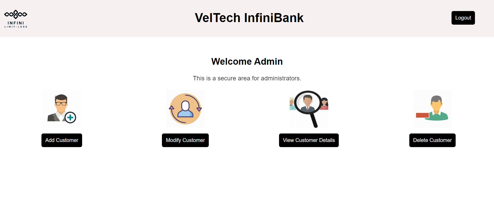
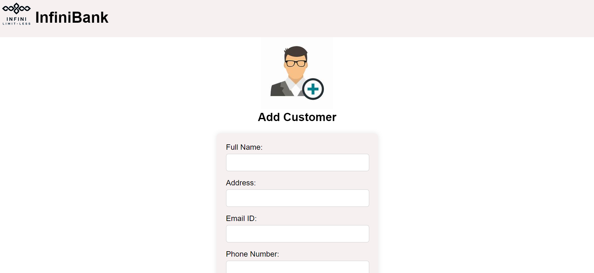
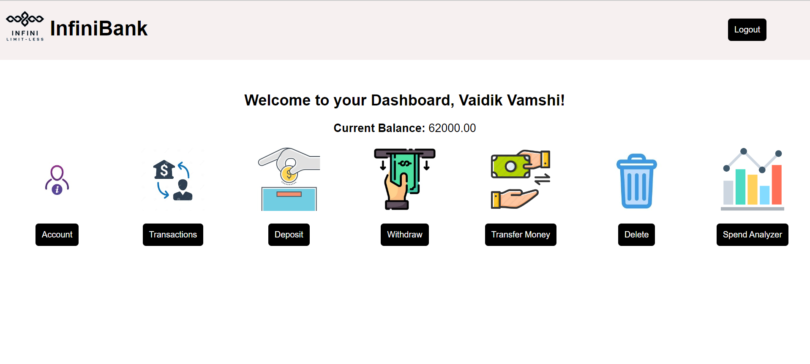
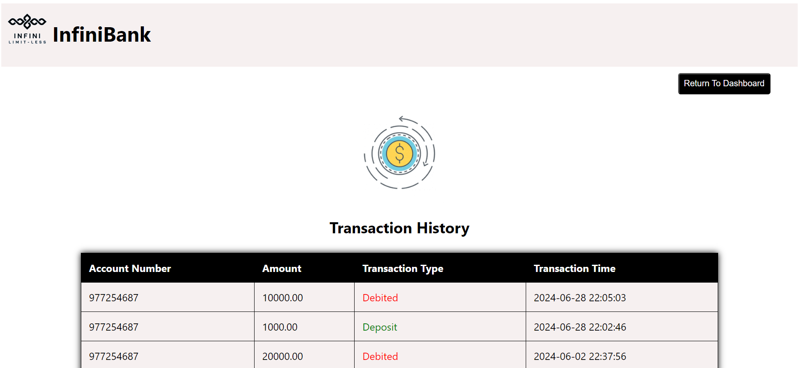

# 🏦 Banking Application

## Overview
This Banking Application is designed to handle basic banking operations such as creating accounts, depositing and withdrawing money, viewing account balances, and more. The application supports both admin and customer roles with specific functionalities for each.

## Features

### Admin Roles
- 🔐 **Pre-registered Admin:** Admin details are pre-registered in the database.
- 🔑 **Admin Login:** Admin can log in using a username and password.
- 📝 **Customer Registration:** Admin can register customers with the following details:
  - Full name
  - Address
  - Mobile No
  - Email id
  - Type of account (Savings or Current)
  - Initial Balance (minimum 1000)
  - Date of Birth
  - ID proof
- 🔄 **Account Creation:** During customer registration, an account number and a temporary password are generated.
- ✏️ **Manage Customer Details:** Admin can add, delete, modify, and view customer details, except for password and balance.

### Customer Roles
- 🆔 **Registration:** Customers are registered by the admin and receive their account number and temporary password.
- 🔒 **Password Setup:** Customers can set up a new password using their account number and temporary password.
- 🔓 **Customer Login:** Customers can log in with their account number and password.
- 🚪 **Logout:** Customers can log out.
- 🏠 **Dashboard:** The customer dashboard displays the created account and balance.
- 📜 **Transaction History:** Customers can view the last 10 transactions.
- 💰 **Deposit:** Customers can deposit money, with transactions saved in the database.
- 🏦 **Withdraw:** Customers can withdraw money, with transactions saved in the database.
- ⚖️ **Balance Maintenance:** Customers can maintain a 0 balance but not below that.
- ❌ **Account Closure:** Customers can close their accounts without admin assistance, only after withdrawing all the money.

### Additional Features
- 💸 **Money Transfer:** Money transfer functionality.
- 📊 **Spend Analyzer:** Spend analyzer for tracking expenses.
- 🌟 **Interactive Pages:** User-friendly and interactive pages.
- 🖨️ **Download Transactions:** Download a PDF of the last 10 transactions.

## Screenshots

### Admin Dashboard

### Customer Registration

### Customer Dashboard

### Transaction History

